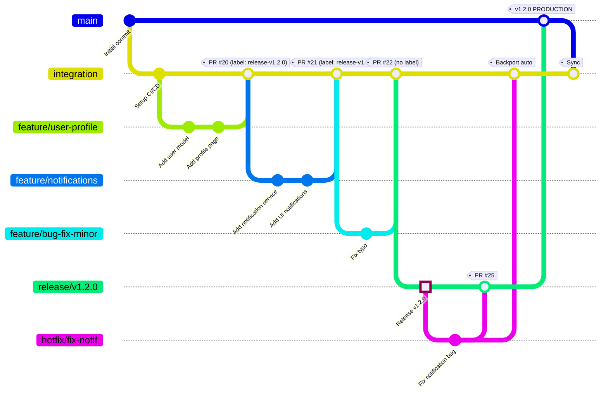
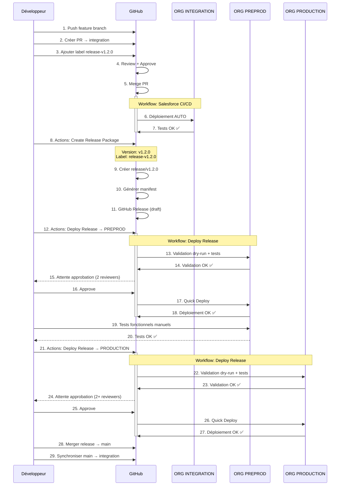
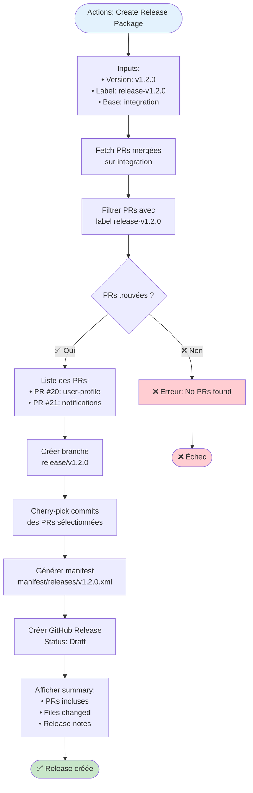
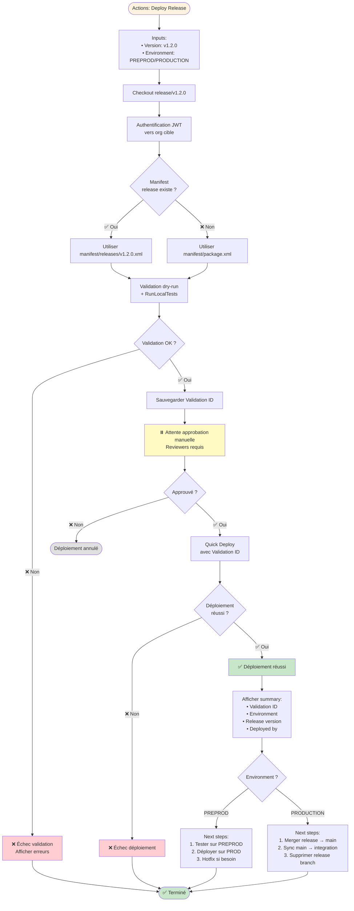

# 🔄 Diagramme du Workflow CI/CD Salesforce

Ce document présente le flux détaillé du processus CI/CD avec architecture Release Branches.

---

## 📊 Vue d'ensemble du processus complet

```mermaid
flowchart TD
    Start([Développeur crée une feature]) --> Branch[Créer branche feature/xxx]
    Branch --> Dev[Développement + Commits]
    Dev --> PR1[Créer PR vers integration]
    PR1 --> Label{Ajouter label release ?}
    Label -->|Oui| LabelAdd[Ajouter label release-vX.Y.Z]
    Label -->|Non| Review1
    LabelAdd --> Review1[Review + Approbation]
    Review1 --> Merge1[Merge vers integration]

    Merge1 --> Deploy1[🤖 Déploiement AUTO sur INTEGRATION]
    Deploy1 --> Tests1[Tests Apex RunLocalTests]
    Tests1 --> Validation1{Tests OK ?}
    Validation1 -->|✅ Oui| Success1[Déployé sur ORG INTEGRATION]
    Validation1 -->|❌ Non| Fail1[Échec - Corriger les tests]
    Fail1 --> Dev

    Success1 --> Decision{Prêt pour release ?}
    Decision -->|Pas encore| End1([Fin - Attendre autres features])
    Decision -->|Oui| CreateRelease[Créer Release Package]

    CreateRelease --> Release1[🎯 Actions: Create Release Package]
    Release1 --> ReleaseInput[Version: v1.2.0<br/>Label: release-v1.2.0]
    ReleaseInput --> ReleaseBranch[Créer branche release/v1.2.0]
    ReleaseBranch --> FilterPRs[Filtrer PRs avec label]
    FilterPRs --> Manifest[Générer manifest]
    Manifest --> GHRelease[Créer GitHub Release draft]

    GHRelease --> DeployPreprod[🚀 Déployer sur PREPROD]
    DeployPreprod --> PreprodAction[Actions: Deploy Release]
    PreprodAction --> PreprodInput[Version: v1.2.0<br/>Env: PREPROD]
    PreprodInput --> Validate[Validation avec tests dry-run]
    Validate --> ValidateOK{Validation OK ?}
    ValidateOK -->|❌ Non| FixRelease[Corriger via hotfix]
    ValidateOK -->|✅ Oui| Approve1[Approbation manuelle 2 reviewers]
    Approve1 --> QuickDeploy1[Quick Deploy sur PREPROD]
    QuickDeploy1 --> TestPreprod[Tests fonctionnels PREPROD]

    TestPreprod --> PreprodOK{Tests PREPROD OK ?}
    PreprodOK -->|❌ Non| Hotfix[Créer hotfix]
    PreprodOK -->|✅ Oui| DeployProd[🚀 Déployer sur PRODUCTION]

    Hotfix --> HotfixBranch[Créer branche hotfix/xxx<br/>depuis release/v1.2.0]
    HotfixBranch --> HotfixDev[Développer le fix]
    HotfixDev --> HotfixPR[PR vers release/v1.2.0]
    HotfixPR --> HotfixMerge[Merge hotfix]
    HotfixMerge --> Backport[🤖 Backport AUTO vers integration]
    HotfixMerge --> DeployPreprod

    DeployProd --> ProdAction[Actions: Deploy Release]
    ProdAction --> ProdInput[Version: v1.2.0 même version<br/>Env: PRODUCTION]
    ProdInput --> ValidateProd[Validation avec tests dry-run]
    ValidateProd --> ValidateProdOK{Validation OK ?}
    ValidateProdOK -->|❌ Non| Emergency[Rollback ou hotfix urgent]
    ValidateProdOK -->|✅ Oui| Approve2[Approbation manuelle 2+ reviewers]
    Approve2 --> QuickDeploy2[Quick Deploy sur PRODUCTION]
    QuickDeploy2 --> ProdSuccess[✅ Déployé sur PRODUCTION]

    ProdSuccess --> PostDeploy[Post-déploiement]
    PostDeploy --> MergeMain[Merger release/v1.2.0 → main]
    MergeMain --> SyncInt[Synchroniser main → integration]
    SyncInt --> Cleanup[Optionnel: Supprimer release branch]
    Cleanup --> End2([✅ Release terminée])

    Emergency --> HotfixBranch

    style Start fill:#e1f5e1
    style Deploy1 fill:#fff4e6
    style Success1 fill:#e1f5e1
    style CreateRelease fill:#e3f2fd
    style DeployPreprod fill:#fff3e0
    style DeployProd fill:#ffe0e0
    style ProdSuccess fill:#c8e6c9
    style End2 fill:#c8e6c9
    style Fail1 fill:#ffcdd2
    style Hotfix fill:#fff9c4
    style Backport fill:#f3e5f5
```

---

## 🏗️ Architecture des branches

---

## 🔄 Flux de déploiement par environnement

---

## 🔥 Flux de hotfix

```mermaid
flowchart LR
    Bug([🐛 Bug découvert<br/>sur PREPROD/PROD]) --> Checkout[git checkout release/v1.2.0]
    Checkout --> Create[git checkout -b<br/>hotfix/fix-bug]
    Create --> Fix[Développer le fix<br/>+ Tests]
    Fix --> Commit[git commit]
    Commit --> Push[git push origin hotfix/fix-bug]
    Push --> PR[Créer PR vers<br/>release/v1.2.0]
    PR --> Review[Review + Approve]
    Review --> Merge[Merge PR]

    Merge --> Auto[🤖 Auto-Backport Workflow]
    Auto --> CherryPick{Cherry-pick<br/>vers integration}
    CherryPick -->|✅ Succès| AutoPR[Créer PR auto<br/>vers integration]
    CherryPick -->|❌ Conflits| Comment[Commenter sur PR<br/>avec instructions manuelles]

    AutoPR --> MergeBack[Review + Merge<br/>vers integration]
    Comment --> Manual[Résolution manuelle<br/>des conflits]
    Manual --> ManualPR[PR manuelle<br/>vers integration]
    ManualPR --> MergeBack

    Merge --> Redeploy[Re-déployer release<br/>sur PREPROD/PROD]

    MergeBack --> Done([✅ Hotfix appliqué<br/>partout])
    Redeploy --> Done

    style Bug fill:#ffcdd2
    style Auto fill:#f3e5f5
    style Done fill:#c8e6c9
```

---

## 📦 Processus de création de release

---

## ⚙️ Workflow de déploiement (Deploy Release)

---

## 🎯 Légende

| Symbole | Signification |
|---------|--------------|
| 🤖 | Action automatique (workflow GitHub Actions) |
| 🚀 | Déploiement vers un environnement |
| ⏸️ | Attente d'approbation manuelle |
| ✅ | Succès / Validation OK |
| ❌ | Échec / Erreur |
| 🐛 | Bug détecté |
| 🔥 | Hotfix urgent |
| 📦 | Package / Release |

---

## 📚 Références

- [README.md](README.md) - Documentation principale
- [RELEASE_PROCESS.md](RELEASE_PROCESS.md) - Guide du processus de release
- [AJOUT_ENVIRONNEMENT.md](AJOUT_ENVIRONNEMENT.md) - Ajouter des environnements
- [JWT_SETUP_GUIDE.md](JWT_SETUP_GUIDE.md) - Configuration JWT

---

**📌 Note** : Ces diagrammes utilisent la syntaxe Mermaid qui est supportée nativement par GitHub, GitLab, et la plupart des éditeurs Markdown modernes (VS Code, Obsidian, etc.).
